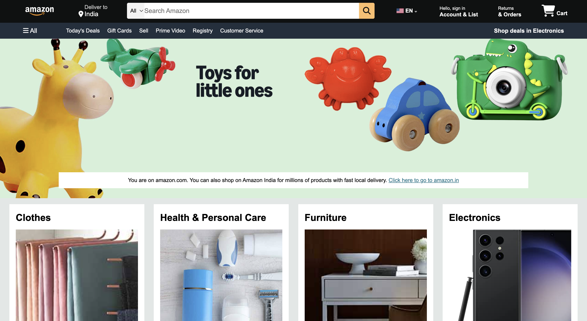

# 🛒 Amazon Clone

A **pixel-perfect Amazon homepage clone** built using **HTML5** and **CSS3**. This project recreates the visual design, layout, spacing, typography, and user interface of Amazon with a strong focus on clean code, responsiveness, and modern frontend development practices.

The project includes a **fully responsive layout**, an **automatic hero image slider created entirely with CSS**, and an **Amazon-style footer** carefully designed to closely match the original website.

---

## 🌐 Live Demo

🔗 https://saranshgupta-dev.github.io/amazon-clone/

---

## 📸 Project Preview



---

# ✨ Features

- 🛍️ Pixel-perfect Amazon-inspired homepage
- 🎨 Built entirely with **HTML5 & CSS3**
- 📱 Fully Responsive Design
- 🧭 Amazon-style Navigation Bar
- 🔍 Search Bar with Category Selector
- 🖼️ Automatic Hero Image Slider (Pure CSS)
- 📦 Product Cards & Shopping Sections
- 🌍 Language Selector UI
- 🦶 Pixel-perfect Amazon Footer
- 🖱️ Smooth Hover Effects
- 📐 Clean Layout using Flexbox & CSS Grid
- ⚡ Fast loading and lightweight design
- 💻 Cross-browser compatible

---

# 🚀 Highlights

- Built **without JavaScript** for UI interactions.
- Hero banner automatically slides using **CSS Animations (@keyframes)**.
- Carefully matched Amazon's:
  - Layout
  - Typography
  - Colors
  - Spacing
  - Hover Effects
  - Footer Design
- Organized folder structure for easy maintenance.
- Beginner-friendly yet portfolio-quality frontend project.

---

# 🛠️ Technologies Used

- HTML5
- CSS3
- CSS Flexbox
- CSS Grid
- CSS Animations
- Font Awesome

---

# 📂 Folder Structure

```text
amazon-clone/
│
├── index.html
├── style.css
├── README.md
│
├── images/
│   ├── amazon_logo.png
│   ├── hero_image.jpg
│   ├── screenshot.png
│   └── ...
│
└── .gitignore
```

---

# ▶️ Getting Started

### Clone the Repository

```bash
git clone https://github.com/saranshgupta-dev/amazon-clone.git
```

### Open the Project

Simply open **index.html** in your browser.

No installation or dependencies required.

---

# 📚 What I Learned

While building this project, I improved my understanding of:

- Semantic HTML
- CSS Flexbox
- CSS Grid
- Responsive Web Design
- CSS Positioning
- CSS Animations
- Hover Effects
- Dropdown Menus
- UI Cloning Techniques
- Frontend Layout Design
- Code Organization

---

# 🎯 Future Improvements

- Add JavaScript functionality
- Functional Search Bar
- Shopping Cart
- Product Slider Controls
- Login & Authentication Pages
- Product Details Page
- Backend Integration
- Mobile Navigation Menu

---

# 👨‍💻 Author

**Saransh Gupta**

### GitHub

https://github.com/saranshgupta-dev

### LinkedIn

https://www.linkedin.com/in/saransh-gupta-dev/

---

## ⭐ Support

If you like this project, please consider giving it a **⭐ Star** on GitHub.

It motivates me to build more high-quality frontend projects.
